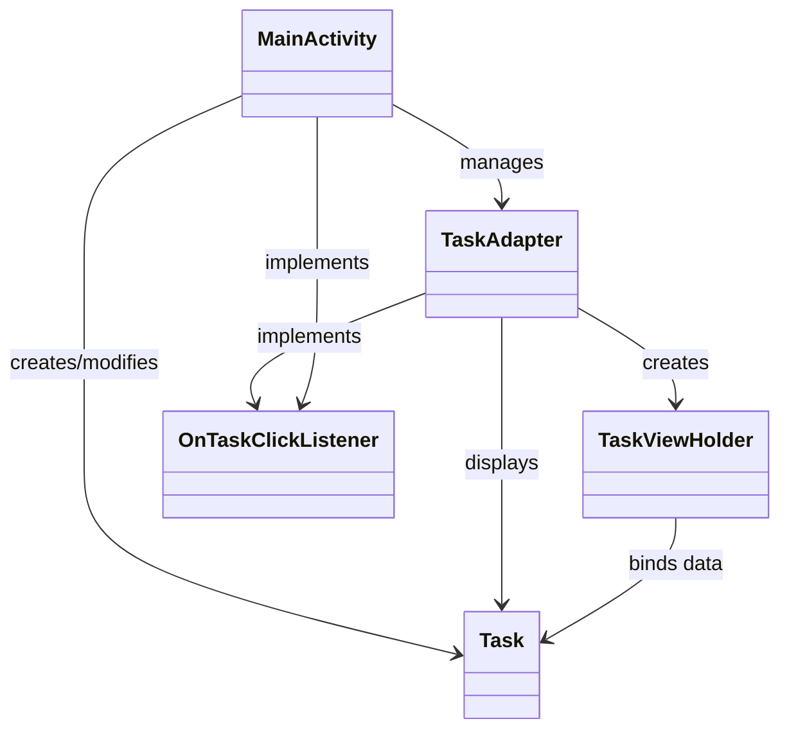
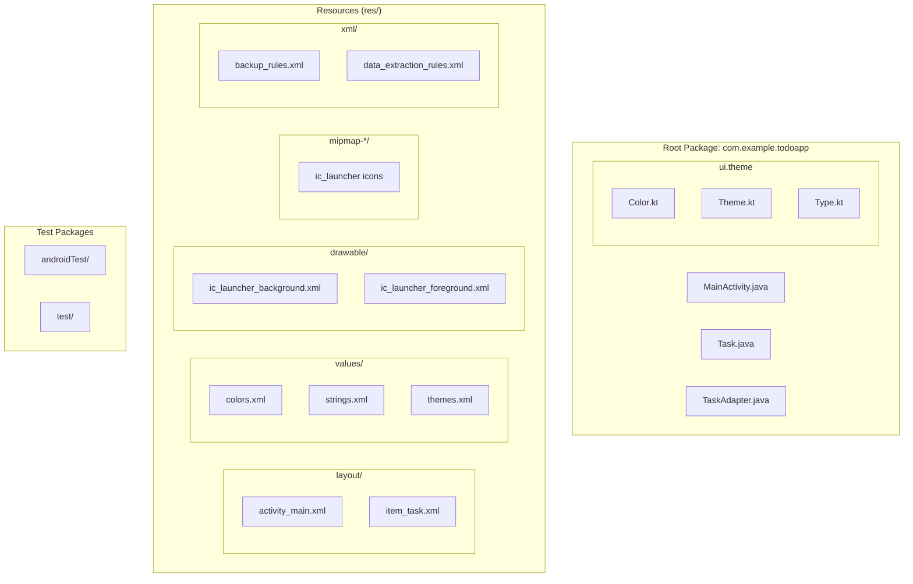
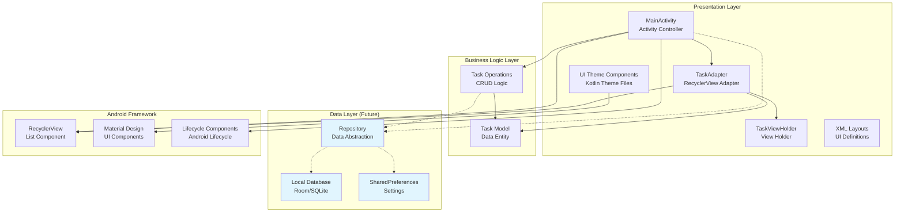
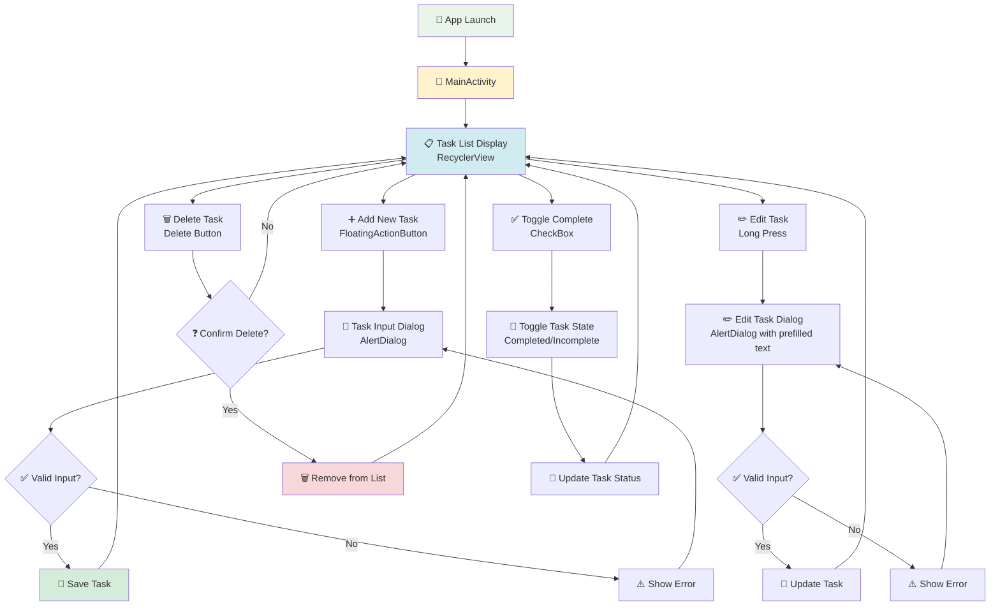

# 🗂️ TodoApp - Especificaciones del Proyecto
## 📋 Información General del Proyecto
| Campo | Valor |
|-------|-------|
| **📛 Nombre del Proyecto** | TodoApp |
| **📱 Plataforma** | Android |
| **💻 Lenguaje Principal** | Java |
| **🎨 Lenguaje Secundario** | Kotlin (UI Theme) |
| **📦 SDK Mínimo** | API Level 21+ |
| **⚙️ Gradle Version** | 8.13 |
| **🏷️ Package Name** | com.example.todoapp |
---
## 🖼️ Preview del Proyecto
>


---
## 🏗️ Arquitectura del Sistema
### 🧩 Patrón Arquitectónico
- **Principal**: Model-View-Controller (MVC)
- **Recomendado**: MVVM (Model-View-ViewModel) para escalabilidad futura
### 🚀 Metodología de Desarrollo
- **Tipo**: Desarrollo Incremental con elementos Ágiles
- **Patrones de Diseño**:
  - 🔄 Adapter Pattern (TaskAdapter)
  - 📦 ViewHolder Pattern (TaskViewHolder)
  - 🗝️ Singleton Pattern (potencial para Repository)
---
## 📊 Diagrama de Clases


---

## 📦 Diagrama de Paquetes



---

## 🔧 Diagrama de Componentes



---

## 🏢 Capas del Sistema

### 1. **Capa de Presentación 🎨 (Presentation Layer)**
| Componente | Ubicación | Responsabilidad |
|------------|-----------|-----------------|
| MainActivity | `app/src/main/java/com/example/todoapp/` | Controlador principal, gestión de UI |
| TaskAdapter | `app/src/main/java/com/example/todoapp/` | Adaptador para RecyclerView |
| TaskViewHolder | Clase interna de TaskAdapter | Optimización de vistas |
| UI Theme | `app/src/main/java/com/example/todoapp/ui/theme/` | Definiciones de tema Material |
| Layouts XML | `app/src/main/res/layout/` | Definiciones de interfaz |

### 2. **Capa de Lógica de Negocio 🧠 (Business Logic Layer)**
| Componente | Ubicación | Responsabilidad |
|------------|-----------|-----------------|
| Task Model | `app/src/main/java/com/example/todoapp/` | Entidad de datos |
| CRUD Operations | MainActivity (actualmente) | Operaciones crear, leer, actualizar, eliminar |

### 3. **Capa de Datos 💾 (Data Layer) - Futura Implementación**
| Componente | Ubicación Propuesta | Responsabilidad |
|------------|-------------------|-----------------|
| Repository | `app/src/main/java/com/example/todoapp/repository/` | Abstracción de datos |
| Database | `app/src/main/java/com/example/todoapp/database/` | Persistencia local |
| DAO | `app/src/main/java/com/example/todoapp/dao/` | Acceso a datos |

### 4. **Capa de Recursos 📂 (Resources Layer)**
| Componente | Ubicación | Responsabilidad |
|------------|-----------|-----------------|
| Layouts | `app/src/main/res/layout/` | Definiciones de UI |
| Values | `app/src/main/res/values/` | Strings, colores, temas |
| Drawables | `app/src/main/res/drawable/` | Recursos gráficos |
| Mipmaps | `app/src/main/res/mipmap-*/` | Iconos de aplicación |

---

## 🗺️ Mapa de Navegación



### Flujo de Usuario Detallado

1. **Inicio de Aplicación**
   - Usuario lanza la app
   - MainActivity se inicializa
   - RecyclerView carga tareas existentes

2. **Gestión de Tareas**
   - **Crear**: FAB → Dialog → Validación → Guardar → Actualizar lista
   - **Editar**: Long press → Dialog → Modificar → Guardar → Actualizar lista
   - **Eliminar**: Botón delete → Confirmación → Eliminar → Actualizar lista
   - **Completar**: CheckBox → Toggle estado → Actualizar UI

3. **Estados de la UI**
   - Lista vacía: Mensaje informativo
   - Lista con elementos: RecyclerView visible
   - Cargando: Progress indicator (futuro)
   - Error: Snackbar con mensaje

---

## 💻 Especificaciones Técnicas de Módulos

### 1. **MainActivity.java**
```java
/**
 * Actividad principal de la aplicación TodoApp
 * Responsabilidades:
 * - Gestión del RecyclerView
 * - Manejo de eventos de usuario
 * - Coordinación entre adapter y modelo
 */
public class MainActivity extends AppCompatActivity implements OnTaskClickListener {
    // Componentes UI
    private RecyclerView recyclerView;
    private FloatingActionButton fabAddTask;
    private TextView emptyStateText;
    
    // Datos y adaptador
    private TaskAdapter adapter;
    private List<Task> taskList;
    
    // Métodos principales
    @Override
    protected void onCreate(Bundle savedInstanceState);
    private void initializeViews();
    private void setupRecyclerView();
    private void setupClickListeners();
    private void showAddTaskDialog();
    private void showEditTaskDialog(Task task, int position);
    private void loadTasks();
    private void saveTasks();
    
    // Implementación de OnTaskClickListener
    @Override
    public void onTaskClick(Task task, int position);
    @Override
    public void onTaskDelete(Task task, int position);
    @Override
    public void onTaskToggle(Task task, int position);
}
```

### 2. **Task.java**
```java
/**
 * Modelo de datos para una tarea
 * Representa una tarea individual con sus propiedades
 */
public class Task implements Serializable {
    // Atributos
    private String title;
    private boolean isCompleted;
    private long id;
    private Date dateCreated;
    private Date dateCompleted;
    
    // Constructores
    public Task();
    public Task(String title);
    public Task(String title, boolean isCompleted);
    
    // Métodos de acceso
    public String getTitle();
    public void setTitle(String title);
    public boolean isCompleted();
    public void setCompleted(boolean completed);
    public long getId();
    public void setId(long id);
    public Date getDateCreated();
    public void setDateCreated(Date dateCreated);
    public Date getDateCompleted();
    public void setDateCompleted(Date dateCompleted);
    
    // Métodos utilitarios
    @Override
    public String toString();
    @Override
    public boolean equals(Object obj);
    @Override
    public int hashCode();
}
```

### 3. **TaskAdapter.java**
```java
/**
 * Adaptador para RecyclerView que maneja la lista de tareas
 * Implementa el patrón ViewHolder para optimización
 */
public class TaskAdapter extends RecyclerView.Adapter<TaskAdapter.TaskViewHolder> {
    // Datos
    private List<Task> tasks;
    private Context context;
    private OnTaskClickListener listener;
    
    // Constructor
    public TaskAdapter(List<Task> tasks, Context context);
    
    // Métodos del RecyclerView.Adapter
    @Override
    public TaskViewHolder onCreateViewHolder(@NonNull ViewGroup parent, int viewType);
    @Override
    public void onBindViewHolder(@NonNull TaskViewHolder holder, int position);
    @Override
    public int getItemCount();
    
    // Métodos de gestión de datos
    public void addTask(Task task);
    public void removeTask(int position);
    public void updateTask(int position, Task task);
    public void setTasks(List<Task> tasks);
    
    // Listener
    public void setOnTaskClickListener(OnTaskClickListener listener);
    
    /**
     * ViewHolder interno para optimización de vistas
     */
    class TaskViewHolder extends RecyclerView.ViewHolder {
        // Vistas
        TextView taskTitle;
        CheckBox taskCheckBox;
        ImageButton deleteButton;
        CardView cardView;
        
        // Constructor
        public TaskViewHolder(@NonNull View itemView);
        
        // Método de enlace
        public void bind(Task task);
        private void setupClickListeners();
    }
}
```

### 4. **Interfaz OnTaskClickListener**
```java
/**
 * Interfaz para manejar eventos de click en tareas
 */
public interface OnTaskClickListener {
    void onTaskClick(Task task, int position);
    void onTaskDelete(Task task, int position);
    void onTaskToggle(Task task, int position);
}
```

---

## 📚 Librerías y Dependencias

### **Librerías Actuales**
```gradle
dependencies {
    // Android Core
    implementation 'androidx.core:core-ktx:1.12.0'
    implementation 'androidx.appcompat:appcompat:1.6.1'
    
    // Material Design
    implementation 'com.google.android.material:material:1.11.0'
    
    // Layout
    implementation 'androidx.constraintlayout:constraintlayout:2.1.4'
    
    // Testing
    testImplementation 'junit:junit:4.13.2'
    androidTestImplementation 'androidx.test.ext:junit:1.1.5'
    androidTestImplementation 'androidx.test.espresso:espresso-core:3.5.1'
}
```

### **Librerías Recomendadas para Mejoras**

#### **Arquitectura MVVM**
```gradle
// ViewModel y LiveData
implementation 'androidx.lifecycle:lifecycle-viewmodel-ktx:2.7.0'
implementation 'androidx.lifecycle:lifecycle-livedata-ktx:2.7.0'
implementation 'androidx.lifecycle:lifecycle-common-java8:2.7.0'

// Fragment
implementation 'androidx.fragment:fragment-ktx:1.6.2'
```

#### **Persistencia de Datos**
```gradle
// Room Database
implementation 'androidx.room:room-runtime:2.6.1'
annotationProcessor 'androidx.room:room-compiler:2.6.1'
implementation 'androidx.room:room-ktx:2.6.1'

// Repository Pattern support
implementation 'androidx.lifecycle:lifecycle-repository:2.7.0'
```

#### **Navegación**
```gradle
// Navigation Component
implementation 'androidx.navigation:navigation-fragment-ktx:2.7.6'
implementation 'androidx.navigation:navigation-ui-ktx:2.7.6'
```

#### **UI/UX Mejorada**
```gradle
// CardView
implementation 'androidx.cardview:cardview:1.0.0'

// RecyclerView (ya incluido en Material Design)
implementation 'androidx.recyclerview:recyclerview:1.3.2'

// SwipeRefreshLayout
implementation 'androidx.swiperefreshlayout:swiperefreshlayout:1.1.0'

// ViewBinding
buildFeatures {
    viewBinding true
}
```

#### **Testing Avanzado**
```gradle
// Testing
testImplementation 'androidx.room:room-testing:2.6.1'
testImplementation 'androidx.arch.core:core-testing:2.2.0'
androidTestImplementation 'androidx.test:core:1.5.0'
androidTestImplementation 'androidx.test:runner:1.5.2'
androidTestImplementation 'androidx.test:rules:1.5.0'
```

---

## 📱 Especificaciones de UI/UX

### **Diseño Material Design**
- **Tema**: Material Design 3
- **Colores**: Definidos en `res/values/colors.xml`
- **Tipografía**: Material Typography Scale
- **Componentes**: Material Components Library

### **Layouts**

#### **activity_main.xml**
```xml
<!-- Estructura sugerida -->
<androidx.coordinatorlayout.widget.CoordinatorLayout>
    <androidx.constraintlayout.widget.ConstraintLayout>
        
        <!-- Toolbar -->
        <com.google.android.material.appbar.MaterialToolbar/>
        
        <!-- RecyclerView para tareas -->
        <androidx.recyclerview.widget.RecyclerView/>
        
        <!-- Estado vacío -->
        <TextView android:id="@+id/emptyStateText"/>
        
    </androidx.constraintlayout.widget.ConstraintLayout>
    
    <!-- FAB para agregar tarea -->
    <com.google.android.material.floatingactionbutton.FloatingActionButton/>
    
</androidx.coordinatorlayout.widget.CoordinatorLayout>
```

#### **item_task.xml**
```xml
<!-- Card para cada tarea -->
<com.google.android.material.card.MaterialCardView>
    <androidx.constraintlayout.widget.ConstraintLayout>
        
        <!-- CheckBox para completar -->
        <CheckBox android:id="@+id/taskCheckBox"/>
        
        <!-- Título de la tarea -->
        <TextView android:id="@+id/taskTitle"/>
        
        <!-- Botón eliminar -->
        <ImageButton android:id="@+id/deleteButton"/>
        
    </androidx.constraintlayout.widget.ConstraintLayout>
</com.google.android.material.card.MaterialCardView>
```

---

## 🔮 Roadmap de Mejoras

### **Fase 1: Optimización Actual (Sprint 1-2)**
- [ ] Implementar ViewBinding
- [ ] Agregar validaciones de entrada
- [ ] Mejorar manejo de errores
- [ ] Implementar estado vacío

### **Fase 2: Persistencia (Sprint 3-4)**
- [ ] Implementar Room Database
- [ ] Crear Repository Pattern
- [ ] Agregar operaciones CRUD completas
- [ ] Implementar backup/restore

### **Fase 3: Arquitectura MVVM (Sprint 5-6)**
- [ ] Migrar a MVVM
- [ ] Implementar ViewModel
- [ ] Usar LiveData/StateFlow
- [ ] Separar lógica de UI

### **Fase 4: Funcionalidades Avanzadas (Sprint 7-8)**
- [ ] Categorías de tareas
- [ ] Fechas de vencimiento
- [ ] Recordatorios/Notificaciones
- [ ] Búsqueda y filtros

### **Fase 5: UX/UI Avanzada (Sprint 9-10)**
- [ ] Animaciones
- [ ] Temas personalizables
- [ ] Modo oscuro
- [ ] Gestos avanzados

---

## 📄 Información de Configuración

### **Build Configuration**
```gradle
android {
    namespace 'com.example.todoapp'
    compileSdk 34

    defaultConfig {
        applicationId "com.example.todoapp"
        minSdk 21
        targetSdk 34
        versionCode 1
        versionName "1.0"
        
        testInstrumentationRunner "androidx.test.runner.AndroidJUnitRunner"
    }

    buildTypes {
        release {
            minifyEnabled false
            proguardFiles getDefaultProguardFile('proguard-android-optimize.txt'), 'proguard-rules.pro'
        }
    }
    
    compileOptions {
        sourceCompatibility JavaVersion.VERSION_1_8
        targetCompatibility JavaVersion.VERSION_1_8
    }
}
```

### **Estructura de Testing**
```
src/
├── test/java/com/example/todoapp/
│   ├── TaskTest.java
│   ├── TaskAdapterTest.java
│   └── ExampleUnitTest.kt
└── androidTest/java/com/example/todoapp/
    ├── MainActivityTest.java
    ├── TaskCRUDTest.java
    └── ExampleInstrumentedTest.kt
```

---

## 👥 Equipo y Responsabilidades

| Rol | Responsabilidades |
|-----|-------------------|
| **Android Developer** | Desarrollo de funcionalidades, UI/UX |
| **QA Tester** | Testing funcional, UI testing |
| **DevOps** | CI/CD, build optimization |
| **Product Owner** | Definición de requerimientos |

---

## 📊 Métricas de Calidad

### **Objetivos de Testing**
- Cobertura de código: > 80%
- UI Tests: Flujos críticos cubiertos
- Performance: Tiempo de carga < 2 segundos

### **Métricas de Performance**
- APK size: < 10 MB
- Memory usage: < 50 MB promedio
- Battery drain: Optimizado para uso prolongado

---

## 📝 Notas de Desarrollo

### **Convenciones de Código**
- Java: Seguir Google Java Style Guide
- Kotlin: Seguir Kotlin Coding Conventions
- XML: Usar naming conventions de Android

### **Git Workflow**
```
main
├── develop
│   ├── feature/add-task-functionality
│   ├── feature/edit-task-dialog
│   └── feature/database-integration
├── hotfix/critical-bug-fix
└── release/v1.0.0
```

---

*Documento generado para TodoApp v1.0.0*
*Última actualización: 15 de agosto, 2025*
*Estado: En desarrollo activo*
